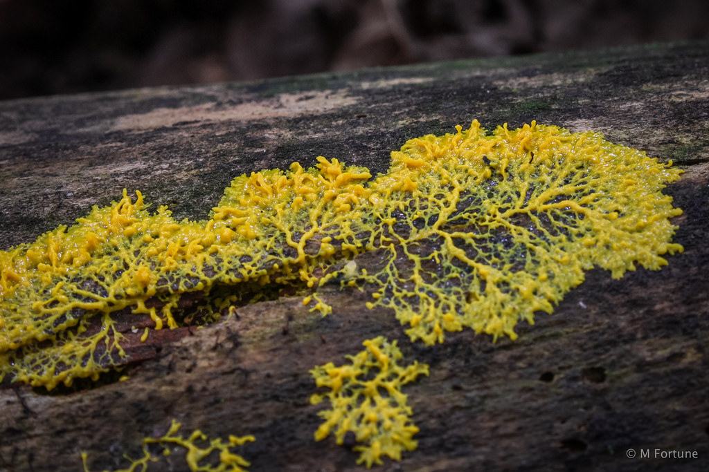

# Slime Mold Simulation

Slime mold ([Physarum polycephalum](https://en.wikipedia.org/wiki/Physarum_polycephalum)) simulation in Unity    
This simulation runs on a Compute Shader (GPU)  
inspired by: https://youtu.be/X-iSQQgOd1A  

Video: https://youtu.be/XLHZVTX6k_E  
## Examples

|||
|-|-|
|  | |
|  | |
## Physarum polycephalum

